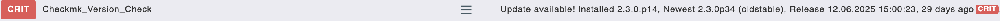

# check_checkmk_version Plugin

## Was tut es?

Das Plugin überwacht die installierte Checkmk-Version und vergleicht sie mit der neuesten verfügbaren Version über die https://download.checkmk.com/stable_downloads.json API. Es warnt nur bei verfügbaren Updates und berücksichtigt dabei konfigurierbare Alters-Schwellenwerte.

**Status-Logik:**

- **OK (0)**: Version ist aktuell 
- **WARNING (1)**: Update verfügbar und älter als `warning_age` Tage (Standard: 27) 
- **CRITICAL (2)**: Update verfügbar und älter als `critical_age` Tage (Standard: 45) 


## Setup

### 1. Repository klonen

```bash
git clone <repository-url> <Pfad, den Checkmk nutzen darf>
```


### 2. Plugin installieren

```bash
# Skript ausführbar machen
chmod +x /opt/checkmk-version-check/check_checkmk_version.sh

# Symlink erstellen (3600 = alle 60 Minuten, nicht jede Minute!)
sudo ln -s /opt/checkmk-version-check/check_checkmk_version.sh /usr/lib/check_mk_agent/local/3600/check_checkmk_version
```


### 3. Konfiguration (optional)
Hinweis: Bei Multi-Instanzsystemen, könnte man glauben, man bräuchte X Konfigurationsdateien, 
ich gehe jedoch davon aus, dass die Schwellwerte auch bei 10 Systemen gleich sein sollten.
```bash
sudo mkdir -p /etc/check_mk
sudo tee /etc/check_mk/check_checkmk_version.conf << 'EOF'
# Schwellenwerte in Tagen
warning_age=14
critical_age=30
EOF
```


## Was benötigt es?

**Abhängigkeiten:**

- `curl` - für API-Aufrufe
- `jq` - für JSON-Parsing
- `cut`, `date` - Standard-Tools
- `omd` - für lokale Versionsinformation

**Installation der Abhängigkeiten:**

```bash
sudo apt-get install curl jq
```

**Unterstützte Checkmk-Editionen:**

- CRE (Raw Edition)
- CEE (Enterprise Edition)
- CCE (Cloud Edition)
- CME (MSP Edition)

Das Plugin erkennt automatisch alle Edition-Suffixe und führt einen intelligenten Versionsvergleich durch.

## License & Disclaimer

This project is licensed under a Custom License - see the [LICENSE](LICENSE) file for details.

**Important:**
- ⚠️ **Use at your own risk** - no warranty or support provided
- ⚠️ **No Backup, no remorse**
- 📖 **Read, understand, and test** before deployment
- 🏢 **Internal business use permitted** - no commercial redistribution
- 👤 **Attribution required** - author name must be mentioned
- 🔧 **Not affiliated with Checkmk GmbH** - independent monitoring tool

## Author

Stephan H. Wenderlich  
Gray-Hat IT-Security Consulting
